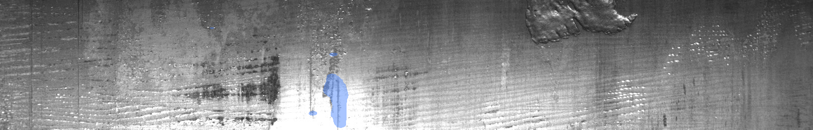
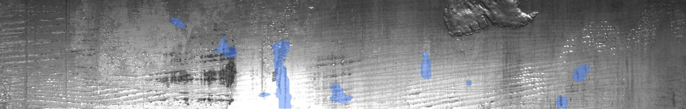
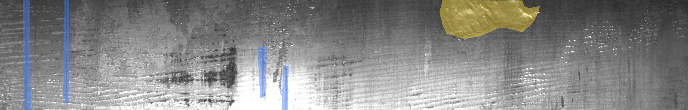
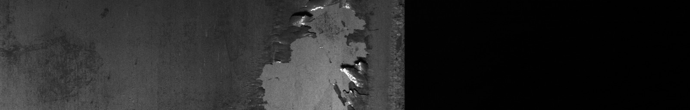

# P01 — Steel Defect Segmentation (Severstal)

Pixel-level **industrial defect segmentation** with class-imbalance handling: baseline UNet vs focal/weighted improved model, per-class Dice, blind holdout QA, FastAPI mask overlay, ONNX CPU latency.

**Hire signal:** improved beats baseline on **blind holdout** (+0.05 mean Dice; class 3 present-only Dice 0.20 vs 0.05). Documented limitation: multi-class head collapse (class 4 not predicted on holdout).

Кратко (RU): сегментация дефектов стали (Severstal), baseline vs improved, blind holdout 19 кадров, API + ONNX.

## Results (full Severstal train, RTX 2070 SUPER)

Split: `seed=42`, `val_frac=0.2`, **19 ImageIds excluded** to blind holdout (`data/holdout_ids.txt`).

| Model | Val mean Dice (best) | Holdout mean Dice | Holdout Dice *present-only* | Holdout class 3 Dice *present-only* |
|-------|---------------------:|------------------:|----------------------------:|------------------------------------:|
| Baseline (`configs/baseline.yaml`) | **0.860** | 0.687 | 0.011 | 0.046 |
| Improved (`configs/improved.yaml`) | **0.867** | **0.737** | **0.050** | **0.201** |

Full JSON: [`artifacts/results_severstal.json`](artifacts/results_severstal.json).

**Metric caveat:** default per-class Dice averages over all val/holdout images; when GT for a class is empty on most images, Dice is inflated (~0.79 for classes 1/2/4). Use `per_class_dice_present_only` from `scripts/eval_holdout.py` for honest rare-class reporting.

**Known limitation:** model detects defects mainly as **class 3 (blue)**; **class 4 (yellow GT)** is not predicted above threshold on blind holdout — see visual QA below.

## Visual QA (blind holdout)

Example overlays (baseline / improved / GT) — regenerate after training:

| ImageId | Baseline | Improved | GT |
|---------|----------|----------|-----|
| `4aa9afc78.jpg` |  |  |  |
| `fe56055d0.jpg` |  |  |  |

```powershell
# Predictions (after training, weights in artifacts/)
foreach ($id in "4aa9afc78","fe56055d0") {
  python -m steel_defect.cli "data/holdout_preview/$id.jpg" --weights artifacts/model_baseline.pt --out "artifacts/overlays/baseline/$id.png"
  python -m steel_defect.cli "data/holdout_preview/$id.jpg" --weights artifacts/model.pt --out "artifacts/overlays/improved/$id.png"
}
python scripts/render_holdout_gt.py --out artifacts/overlays/gt_holdout
python scripts/eval_holdout.py --config configs/baseline.yaml --weights artifacts/model_baseline.pt
python scripts/eval_holdout.py --config configs/improved.yaml --weights artifacts/model.pt
```

## Stack

Python 3.11 · PyTorch (CUDA) · segmentation-models-pytorch · albumentations · FastAPI · ONNX Runtime · Docker · GitHub Actions

## Dataset & license

- Kaggle: [severstal-steel-defect-detection](https://www.kaggle.com/c/severstal-steel-defect-detection) — follow competition rules; **do not commit raw images**.
- See [`data/README.md`](data/README.md).

Smoke without Kaggle:

```bash
python scripts/download_data.py --source synthetic --subset 64
```

## Quickstart

```bash
cd P01-steel-defect-seg
python -m venv .venv
# Windows: .venv\Scripts\activate
pip install -U pip
pip install -e ".[dev]"
pip install torch torchvision --index-url https://download.pytorch.org/whl/cu124

python scripts/download_data.py --source kaggle   # or synthetic --subset 64
python scripts/train.py --config configs/baseline.yaml
python scripts/train.py --config configs/improved.yaml
python scripts/eval_holdout.py --config configs/improved.yaml
python scripts/export_onnx.py --config configs/improved.yaml

uvicorn steel_defect.api:app --host 0.0.0.0 --port 8000
```

Docker:

```bash
docker compose -f docker/docker-compose.yml up --build -d
curl -s http://127.0.0.1:8000/health
```

## Imbalance strategy

| Run | Loss | Class weights |
|-----|------|----------------|
| Baseline | Dice + BCE | uniform `[1,1,1,1]` |
| Improved | Dice + **focal BCE (γ=2)** | `[1.5, 3.0, 1.0, 1.2]` |

Optional experiment: `configs/improved_class4_focus.yaml` (higher weight + oversample class 4) — did not fix holdout class 4 recall.

## GitHub publish

See [`docs/github-publish.md`](docs/github-publish.md).

**Commit:** code, configs, docs, `artifacts/results_severstal.json`, `docs/assets/demo/`.  
**Do not commit:** `data/raw/`, `data/holdout_preview/`, `*.pt`, local `artifacts/overlays/`.  
**Weights:** attach `model_baseline.pt` + `model.pt` to a GitHub Release (~93 MB each) or train locally.

## Project layout

```text
src/steel_defect/   # RLE, dataset, losses, models, API
scripts/            # download, train, eval, eval_holdout, export_onnx
configs/            # baseline.yaml, improved.yaml
docs/               # interview.md, design-decisions.md, github-publish.md
docker/
tests/
```

## Scope limits

No Kaggle account farming, no private mill data, TensorRT optional only when GPU deploy is in scope.

## License

Code: MIT ([LICENSE](LICENSE)). Dataset: Kaggle competition terms (not redistributed here).
